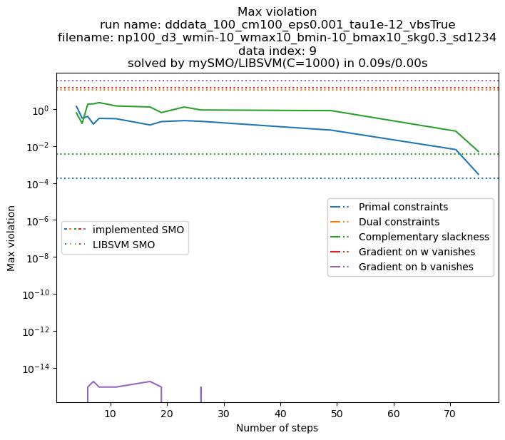
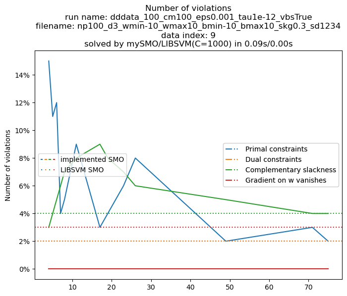

# svm

Numpy implementation of Sequential Minimal Optimization (SMO) and Parallel Dual Coordinate Descent (PDCD) for Support Vector Machine (SVM).

# Problem Statement

1. Given dimension $n$, parameters $w\in\mathbb{R}^n,b\in\mathbb{R}$, obtain a hyperplane $w^Tx+b=0$
2. Generate data $\{(x_1,y_1),\ldots,(x_N,y_N\}$ where $x_i\in\mathbb{R}^n,y_i\in\{-1,1\}$, satisfying $y_i(w^Tx+b)\ge0$ for $i=1,2,\ldots,N$
3. Solve the optimal hyperplane that divides the data

# Method

## Data generation

```bash
python generate.py --num_points 100
python plot_generate.py
```

| Shrinkage | 1                                                            | 0.8                                                          | 0.6                                                          | 0.4                                                          | 0.2                                                          | 0                                                            |
| --------- | ------------------------------------------------------------ | ------------------------------------------------------------ | ------------------------------------------------------------ | ------------------------------------------------------------ | ------------------------------------------------------------ | ------------------------------------------------------------ |
| Plot      |  |  |  |  |  |  |

## SMO

Implementation of  [Working set selection using second order information for training SVM](https://www.csie.ntu.edu.tw/~cjlin/papers/quadworkset.pdf).

```bash
python smo/smo.py --data_dir data_100 --w 100 1 --b -1
python smo/plot_result.py  
```

|  |  |
| ------------------------------------------------------------ | ------------------------------------------------------------ |

For even larger data:

| Time (s)  | min  | max  | mean | std  |
| :-------: | :--: | :--: | :--: | :--: |
| n=2,s=0.7 | 11.5 | 19.9 | 14.8 | 2.46 |
| n=2,s=0.5 | 14.3 | 22.7 | 17.8 | 2.90 |
| n=2,s=0.3 | 14.6 | 50.0 | 25.4 | 12.3 |
| n=3,s=0.7 | 15.0 | 33.4 | 23.6 | 6.66 |
| n=3,s=0.5 | 14.9 | 69.8 | 36.0 | 15.7 |
| n=3,s=0.3 | 25.3 | 335  | 140  | 103  |
|           | 11.5 | 335  | 42.9 |      |

|               n=3,s=0.3               |       KKT1        | KKT2 |       KKT3        |      KKT4w      |     KKT4b     |
| :-----------------------------------: | :---------------: | :--: | :---------------: | :-------------: | :-----------: |
|     max vialation<br />[min, max]     |  [0.0004, 0.005]  |  0   |   [0.01, 0.09]    | [9e-16, 4e-15]  |  [0, 7e-15]   |
|     max violation<br />mean ± std     |   0.003 ± 0.002   |  0   |    0.04 ± 0.02    |  2e-15 ± 9e-16  | 2e-15 ± 2e-15 |
| violation percentage<br /> [min, max] | [0.0046%, 0.040%] |  0   | [7e-4%, 2.5e-4%]  | [2e-4%, 3e-4%]  |       /       |
| violation percentage<br />mean ± std  |  0.020% ± 1e-10   |  0   | 0.0017% ± 6.1e-12 | 2.5e-4% ± 5e-13 |       /       |

where Karush–Kuhn–Tucker conditions are:

1. primal constraints: $1-y_i(w^Tx_i+b)\le0,i=1,\ldots,N$
2. dual constraints: $\alpha\succeq 0$
3. complementary slackness: $\alpha_i (1-y_i(w^Tx_i+b))=0,i=1,\ldots,N$
4. gradient of Lagrangian vanishes: $\sum_{i=1}^l\alpha_i y_i x_i=w$ and $\sum_{i=1}^l\alpha_i y_i=0$

## PDCD

Implementation of [Parallel Dual Coordinate Descent Method for Large-scale Linear Classification in Multi-core Environments](https://www.csie.ntu.edu.tw/~cjlin/papers/multicore_cddual.pdf). Also check the pseudocode in [supplementary materials](https://www.csie.ntu.edu.tw/~cjlin/libsvmtools/multicore-liblinear/multicore_cddual_supplement.pdf),

```bash
python pdcd/pdcd.py
```

# Acknowledgments

Engineering Math, Tongji University Course 10002870002
